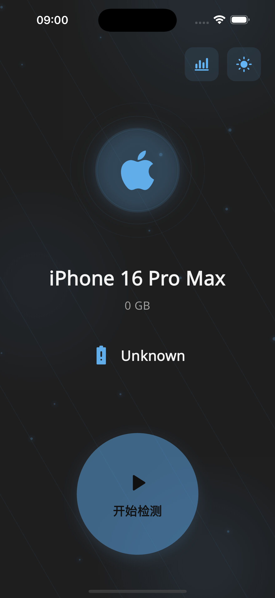

# 手机检测工具 (Phone Diagnostic Tool)

一款功能强大的手机硬件检测工具，基于Flutter跨平台框架开发，帮助用户全面了解设备状况。

[](https://flutter.dev)
[](https://dart.dev)
[]()

## 项目预览

### 主页面 检测过程



## 项目说明

这是一个基于 Flutter 开发的手机硬件检测工具，提供全面的设备检测功能，帮助用户诊断设备性能、监测硬件状况并获取专业优化建议。通过简单直观的界面，用户可以轻松完成设备的全方位检测，及时发现潜在问题。本工具采用模块化架构设计，确保代码可维护性和扩展性。

## 功能特点

### 1. 全面的检测功能
- **屏幕显示检测** - 测试触控灵敏度和显示效果
  ```dart
  Future<ScreenCheckResult> checkScreenDisplay() async {
    final DisplayInfo displayInfo = await DeviceUtils.getDisplayInfo();
    final bool touchResponsive = await TouchTestUtil.performTouchTest();
    return ScreenCheckResult(
      resolution: '${displayInfo.width}x${displayInfo.height}',
      density: displayInfo.pixelDensity,
      refreshRate: displayInfo.refreshRate,
      touchResponse: touchResponsive ? 'Normal' : 'Abnormal',
    );
  }
  ```

- **摄像头检测** - 验证前后摄像头功能
  ```dart
  Future<CameraCheckResult> checkCameraFunctionality() async {
    final List<CameraDescription> cameras = await availableCameras();
    final bool hasFrontCamera = cameras.any((camera) => camera.lensDirection == CameraLensDirection.front);
    final bool hasRearCamera = cameras.any((camera) => camera.lensDirection == CameraLensDirection.back);
    
    CameraController? controller;
    bool rearCameraWorking = false;
    bool frontCameraWorking = false;
    
    // 检测后置摄像头
    if (hasRearCamera) {
      final rearCamera = cameras.firstWhere((camera) => camera.lensDirection == CameraLensDirection.back);
      controller = CameraController(rearCamera, ResolutionPreset.medium);
      try {
        await controller.initialize();
        await controller.takePicture();
        rearCameraWorking = true;
      } catch (e) {
        rearCameraWorking = false;
      } finally {
        await controller.dispose();
      }
    }
    
    // 检测前置摄像头
    if (hasFrontCamera) {
      final frontCamera = cameras.firstWhere((camera) => camera.lensDirection == CameraLensDirection.front);
      controller = CameraController(frontCamera, ResolutionPreset.medium);
      try {
        await controller.initialize();
        await controller.takePicture();
        frontCameraWorking = true;
      } catch (e) {
        frontCameraWorking = false;
      } finally {
        await controller.dispose();
      }
    }
    
    return CameraCheckResult(
      hasFrontCamera: hasFrontCamera,
      hasRearCamera: hasRearCamera,
      frontCameraWorking: frontCameraWorking,
      rearCameraWorking: rearCameraWorking,
    );
  }
  ```

- **扬声器检测** - 测试音频输出质量
  ```dart
  Future<SpeakerCheckResult> checkSpeakers() async {
    final AudioPlayer player = AudioPlayer();
    bool mainSpeakerWorking = false;
    bool earSpeakerWorking = false;
    double volume = 0.0;
    
    // 检测主扬声器
    try {
      // 加载测试音频
      await player.setAsset('assets/audio/test_sound.mp3');
      
      // 设置音量并播放
      await player.setVolume(0.7);
      volume = await player.getVolume();
      await player.play();
      
      // 等待播放完成
      await Future.delayed(const Duration(seconds: 3));
      
      // 获取音频输出状态
      final processingState = player.processingState;
      mainSpeakerWorking = processingState == ProcessingState.completed;
      
      // 切换到听筒模式测试
      await AudioSession.instance.then((session) {
        session.configure(const AudioSessionConfiguration(
          avAudioSessionCategory: AVAudioSessionCategory.playAndRecord,
          avAudioSessionMode: AVAudioSessionMode.voiceChat,
        ));
      });
      
      await player.setAsset('assets/audio/test_sound.mp3');
      await player.play();
      await Future.delayed(const Duration(seconds: 3));
      
      earSpeakerWorking = player.processingState == ProcessingState.completed;
    } catch (e) {
      print('扬声器检测错误: $e');
    } finally {
      await player.dispose();
    }
    
    return SpeakerCheckResult(
      mainSpeakerWorking: mainSpeakerWorking,
      earSpeakerWorking: earSpeakerWorking,
      volume: volume,
    );
  }
  ```

- **传感器检测** - 检查重力、加速度等传感器
  ```dart
  class SensorCheckResult {
    final bool accelerometerWorking;
    final bool gyroscopeWorking;
    final bool magnetometerWorking;
    final Map<String, dynamic> sensorValues;
    
    SensorCheckResult({
      required this.accelerometerWorking,
      required this.gyroscopeWorking,
      required this.magnetometerWorking,
      required this.sensorValues,
    });
  }
  
  Future<SensorCheckResult> checkDeviceSensors() async {
    bool accelerometerWorking = false;
    bool gyroscopeWorking = false;
    bool magnetometerWorking = false;
    
    final Map<String, dynamic> sensorValues = {};
    
    // 检测加速度计
    try {
      final completer = Completer<AccelerometerEvent>();
      StreamSubscription<AccelerometerEvent>? subscription;
      
      subscription = accelerometerEvents.listen((event) {
        if (!completer.isCompleted) {
          completer.complete(event);
          subscription?.cancel();
        }
      });
      
      // 等待传感器数据
      final result = await completer.future.timeout(
        const Duration(seconds: 3),
        onTimeout: () => const AccelerometerEvent(0, 0, 0),
      );
      
      accelerometerWorking = result.x != 0 || result.y != 0 || result.z != 0;
      sensorValues['accelerometer'] = {
        'x': result.x,
        'y': result.y,
        'z': result.z,
      };
    } catch (e) {
      print('加速度计检测错误: $e');
    }
    
    // 检测陀螺仪
    try {
      final completer = Completer<GyroscopeEvent>();
      StreamSubscription<GyroscopeEvent>? subscription;
      
      subscription = gyroscopeEvents.listen((event) {
        if (!completer.isCompleted) {
          completer.complete(event);
          subscription?.cancel();
        }
      });
      
      final result = await completer.future.timeout(
        const Duration(seconds: 3),
        onTimeout: () => const GyroscopeEvent(0, 0, 0),
      );
      
      gyroscopeWorking = result.x != 0 || result.y != 0 || result.z != 0;
      sensorValues['gyroscope'] = {
        'x': result.x,
        'y': result.y,
        'z': result.z,
      };
    } catch (e) {
      print('陀螺仪检测错误: $e');
    }
    
    // 检测磁力计
    try {
      final completer = Completer<MagnetometerEvent>();
      StreamSubscription<MagnetometerEvent>? subscription;
      
      subscription = magnetometerEvents.listen((event) {
        if (!completer.isCompleted) {
          completer.complete(event);
          subscription?.cancel();
        }
      });
      
      final result = await completer.future.timeout(
        const Duration(seconds: 3),
        onTimeout: () => const MagnetometerEvent(0, 0, 0),
      );
      
      magnetometerWorking = result.x != 0 || result.y != 0 || result.z != 0;
      sensorValues['magnetometer'] = {
        'x': result.x,
        'y': result.y,
        'z': result.z,
      };
    } catch (e) {
      print('磁力计检测错误: $e');
    }
    
    return SensorCheckResult(
      accelerometerWorking: accelerometerWorking,
      gyroscopeWorking: gyroscopeWorking,
      magnetometerWorking: magnetometerWorking,
      sensorValues: sensorValues,
    );
  }
  ```

- **电池状态检测** - 分析电池健康度和续航能力
  ```dart
  Future<BatteryStatus> getBatteryStatus() async {
    final int level = await BatteryUtil.getBatteryLevel();
    final BatteryState state = await BatteryUtil.getBatteryState();
    final int health = await BatteryUtil.getBatteryHealth();
    
    return BatteryStatus(
      level: level,
      state: state,
      health: health,
      temperature: await BatteryUtil.getBatteryTemperature(),
      chargingStatus: state == BatteryState.charging ? '充电中' : '未充电',
    );
  }
  ```

- **网络连接检测** - 测试网络连接稳定性
  ```dart
  Future<NetworkCheckResult> checkNetworkConnection() async {
    bool hasInternet = false;
    String connectionType = 'unknown';
    double downloadSpeed = 0;
    double uploadSpeed = 0;
    int latency = 0;
    
    // 检测互联网连接
    try {
      final result = await InternetAddress.lookup('google.com');
      hasInternet = result.isNotEmpty && result[0].rawAddress.isNotEmpty;
    } on SocketException catch (_) {
      hasInternet = false;
    }
    
    // 获取连接类型
    final connectivityResult = await Connectivity().checkConnectivity();
    if (connectivityResult == ConnectivityResult.mobile) {
      connectionType = 'mobile';
    } else if (connectivityResult == ConnectivityResult.wifi) {
      connectionType = 'wifi';
    } else if (connectivityResult == ConnectivityResult.ethernet) {
      connectionType = 'ethernet';
    } else if (connectivityResult == ConnectivityResult.none) {
      connectionType = 'none';
    }
    
    // 测试网络速度和延迟
    if (hasInternet) {
      // 测量延迟
      try {
        final stopwatch = Stopwatch()..start();
        await http.get(Uri.parse('https://www.google.com'));
        stopwatch.stop();
        latency = stopwatch.elapsedMilliseconds;
      } catch (e) {
        print('延迟测试错误: $e');
      }
      
      // 测量下载速度
      try {
        final stopwatch = Stopwatch()..start();
        final response = await http.get(Uri.parse('https://speed.cloudflare.com/__down?bytes=10000000'));
        stopwatch.stop();
        
        if (response.statusCode == 200) {
          final bytesReceived = response.bodyBytes.length;
          final seconds = stopwatch.elapsedMilliseconds / 1000;
          downloadSpeed = (bytesReceived / seconds) / (1024 * 1024); // 转换为Mbps
        }
      } catch (e) {
        print('下载速度测试错误: $e');
      }
      
      // 测量上传速度
      try {
        final data = Uint8List(1024 * 1024); // 1MB数据
        final stopwatch = Stopwatch()..start();
        final response = await http.post(
          Uri.parse('https://speed.cloudflare.com/__up'),
          body: data,
        );
        stopwatch.stop();
        
        if (response.statusCode == 200) {
          final bytesSent = data.length;
          final seconds = stopwatch.elapsedMilliseconds / 1000;
          uploadSpeed = (bytesSent / seconds) / (1024 * 1024); // 转换为Mbps
        }
      } catch (e) {
        print('上传速度测试错误: $e');
      }
    }
    
    return NetworkCheckResult(
      isConnected: hasInternet,
      connectionType: connectionType,
      downloadSpeed: downloadSpeed,
      uploadSpeed: uploadSpeed,
      latency: latency,
    );
  }
  ```

- **存储空间检测** - 分析存储空间使用情况
  ```dart
  Future<StorageCheckResult> checkStorageSpace() async {
    int totalSpace = 0;
    int freeSpace = 0;
    int usedSpace = 0;
    Map<String, int> appStorageUsage = {};
    
    // 获取存储空间信息
    try {
      final Directory? externalDir = await getExternalStorageDirectory();
      if (externalDir != null) {
        final StatFs stat = StatFs(externalDir.path);
        
        // 获取总空间
        totalSpace = stat.blockCountLong * stat.blockSizeLong;
        
        // 获取可用空间
        freeSpace = stat.availableBlocksLong * stat.blockSizeLong;
        
        // 计算已用空间
        usedSpace = totalSpace - freeSpace;
      }
    } catch (e) {
      print('存储空间检测错误: $e');
    }
    
    // 获取应用存储使用情况
    try {
      final PackageInfo packageInfo = await PackageInfo.fromPlatform();
      final String packageName = packageInfo.packageName;
      
      final AppSpaceInfo appSpaceInfo = await AppStorage.getAppSpaceInfo();
      appStorageUsage = {
        'codeSize': appSpaceInfo.codeSize,
        'dataSize': appSpaceInfo.dataSize,
        'cacheSize': appSpaceInfo.cacheSize,
      };
    } catch (e) {
      print('应用存储使用情况检测错误: $e');
    }
    
    return StorageCheckResult(
      totalSpace: totalSpace,
      freeSpace: freeSpace,
      usedSpace: usedSpace,
      appStorageUsage: appStorageUsage,
    );
  }
  ```

- **定位功能检测** - 验证GPS准确性
  ```dart
  Future<LocationCheckResult> checkLocationFunctionality() async {
    bool serviceEnabled = false;
    LocationPermission permission;
    bool hasPermission = false;
    bool gpsWorking = false;
    Position? position;
    double? accuracy;
    
    // 检查定位服务是否启用
    try {
      serviceEnabled = await Geolocator.isLocationServiceEnabled();
      if (!serviceEnabled) {
        return LocationCheckResult(
          serviceEnabled: false,
          hasPermission: false,
          gpsWorking: false,
          accuracy: null,
          position: null,
        );
      }
      
      // 检查定位权限
      permission = await Geolocator.checkPermission();
      if (permission == LocationPermission.denied) {
        permission = await Geolocator.requestPermission();
        if (permission == LocationPermission.denied) {
          return LocationCheckResult(
            serviceEnabled: true,
            hasPermission: false,
            gpsWorking: false,
            accuracy: null,
            position: null,
          );
        }
      }
      
      if (permission == LocationPermission.deniedForever) {
        return LocationCheckResult(
          serviceEnabled: true,
          hasPermission: false,
          gpsWorking: false,
          accuracy: null,
          position: null,
        );
      }
      
      hasPermission = permission == LocationPermission.whileInUse || 
                       permission == LocationPermission.always;
      
      // 获取位置
      if (hasPermission) {
        position = await Geolocator.getCurrentPosition(
          desiredAccuracy: LocationAccuracy.high,
          timeLimit: const Duration(seconds: 10),
        );
        
        gpsWorking = position != null;
        accuracy = position?.accuracy;
      }
    } catch (e) {
      print('定位功能检测错误: $e');
    }
    
    return LocationCheckResult(
      serviceEnabled: serviceEnabled,
      hasPermission: hasPermission,
      gpsWorking: gpsWorking,
      accuracy: accuracy,
      position: position,
    );
  }
  ```

- **WiFi功能检测** - 测试WiFi信号强度
  ```dart
  Future<WiFiCheckResult> checkWiFiFunctionality() async {
    bool isWifiEnabled = false;
    bool isConnected = false;
    String? ssid;
    int signalStrength = 0;
    String ipAddress = '';
    
    // 检查WiFi是否启用
    try {
      final wifiInfo = await WiFiInfo.wifiDetails;
      isWifiEnabled = wifiInfo != null;
      
      if (isWifiEnabled) {
        // 获取WiFi连接信息
        ssid = wifiInfo!.ssid;
        isConnected = ssid != null && ssid.isNotEmpty;
        
        // 获取信号强度
        signalStrength = wifiInfo.signalStrength ?? 0;
        
        // 获取IP地址
        ipAddress = wifiInfo.ipAddress ?? '';
      }
    } catch (e) {
      print('WiFi功能检测错误: $e');
    }
    
    return WiFiCheckResult(
      isWifiEnabled: isWifiEnabled,
      isConnected: isConnected,
      ssid: ssid,
      signalStrength: signalStrength,
      ipAddress: ipAddress,
    );
  }
  ```

- **蓝牙功能检测** - 检查蓝牙连接质量
  ```dart
  Future<BluetoothCheckResult> checkBluetoothFunctionality() async {
    bool isAvailable = false;
    bool isEnabled = false;
    List<BluetoothDevice> devices = [];
    
    // 初始化蓝牙
    try {
      final FlutterBlue flutterBlue = FlutterBlue.instance;
      
      // 检查蓝牙是否可用
      isAvailable = await flutterBlue.isAvailable;
      
      if (isAvailable) {
        // 检查蓝牙是否开启
        isEnabled = await flutterBlue.isOn;
        
        if (isEnabled) {
          // 扫描设备
          flutterBlue.startScan(timeout: const Duration(seconds: 5));
          
          // 获取扫描结果
          await for (List<ScanResult> results in flutterBlue.scanResults) {
            devices = results.map((r) => r.device).toList();
            break; // 只获取一次扫描结果
          }
          
          await flutterBlue.stopScan();
        }
      }
    } catch (e) {
      print('蓝牙功能检测错误: $e');
    }
    
    return BluetoothCheckResult(
      isAvailable: isAvailable,
      isEnabled: isEnabled,
      deviceCount: devices.length,
      devices: devices,
    );
  }
  ```

### 2. 智能报告系统
- **生成详细的检测报告**
  ```dart
  class DiagnosticReport {
    final String deviceModel;
    final String osVersion;
    final Map<String, CheckResult> checkResults;
    final int overallScore;
    final List<String> recommendations;
    
    DiagnosticReport({
      required this.deviceModel,
      required this.osVersion,
      required this.checkResults,
      required this.overallScore,
      required this.recommendations,
    });
    
    Map<String, dynamic> toJson() => {
      'deviceModel': deviceModel,
      'osVersion': osVersion,
      'checkResults': checkResults.map((k, v) => MapEntry(k, v.toJson())),
      'overallScore': overallScore,
      'recommendations': recommendations,
    };
    
    // 从JSON解析报告
    factory DiagnosticReport.fromJson(Map<String, dynamic> json) {
      // 实现从JSON解析的逻辑
    }
  }
  ```

- **设备得分评估**
- **专业优化建议**
- **分类评分展示**


## 技术栈

- **框架**: [Flutter](https://flutter.dev/) - 谷歌开源的UI工具包
- **状态管理**: [GetX](https://pub.dev/packages/get) - 高性能的状态管理、依赖注入和路由管理
- **架构模式**: MVC (Model-View-Controller)
- **数据存储**: [SharedPreferences](https://pub.dev/packages/shared_preferences) - 轻量级的键值对存储
- **网络请求**: [Dio](https://pub.dev/packages/dio) - 强大的HTTP客户端
- **UI设计**: [Material Design](https://material.io/design) - 谷歌设计规范
- **动画**: Flutter Animation
- **设备信息**: [device_info_plus](https://pub.dev/packages/device_info_plus) - 获取设备详细信息
- **传感器**: [sensors_plus](https://pub.dev/packages/sensors_plus) - 访问设备传感器数据

## 开发环境要求

- Flutter 3.0.0 或更高版本
- Dart 2.17.0 或更高版本
- Android Studio / VS Code
- iOS 开发需要 MacOS 系统和 Xcode

## 项目设置

1. 克隆项目
   ```bash
   git clone [项目仓库URL]
   cd phone_diagnostic_tool
   ```

2. 安装依赖
   ```bash
   flutter pub get
   ```

3. 配置环境变量（可选）
   ```bash
   # 创建.env文件
   touch .env
   # 添加必要的环境变量
   echo "API_URL=https://api.example.com/v1" >> .env
   echo "DEBUG_MODE=true" >> .env
   ```

4. 运行应用
   ```bash
   # 调试模式运行
   flutter run
   
   # 生成发布版本
   flutter build apk --release  # Android
   flutter build ios --release  # iOS
   ```

## 项目结构

```
lib/
├── main.dart              # 应用入口点
├── pages/                 # 页面视图
│   ├── check/             # 检测相关页面
│   │   ├── screen_check.dart
│   │   ├── camera_check.dart
│   │   └── battery_check.dart
│   ├── report/            # 报告相关页面
│   │   ├── report_page.dart
│   │   └── report_detail.dart
│   └── home/              # 主页相关页面
│       └── home_page.dart
├── models/                # 数据模型
│   ├── check_result.dart
│   ├── device_info.dart
│   └── diagnostic_report.dart
├── controllers/           # 业务逻辑控制器
│   ├── check_controller.dart
│   ├── report_controller.dart
│   └── app_controller.dart
├── utils/                 # 工具函数
│   ├── device_utils.dart
│   ├── battery_util.dart
│   └── network_util.dart
├── widgets/               # 可复用组件
│   ├── check_card.dart
│   ├── progress_indicator.dart
│   └── score_display.dart
└── services/              # 服务层
    ├── api_service.dart
    ├── storage_service.dart
    └── analytics_service.dart
```

## 核心代码示例

### 检测控制器示例

```dart
class CheckController extends GetxController {
  final RxBool isChecking = false.obs;
  final RxInt currentProgress = 0.obs;
  final RxMap<String, CheckResult> results = <String, CheckResult>{}.obs;
  
  Future<void> startFullCheck() async {
    try {
      isChecking.value = true;
      
      // 屏幕检测
      currentProgress.value = 10;
      results['screen'] = await _checkScreen();
      
      // 摄像头检测
      currentProgress.value = 20;
      results['camera'] = await _checkCamera();
      
      // 更多检测...
      
      currentProgress.value = 100;
      await _generateReport();
    } catch (e) {
      Get.snackbar('检测失败', '发生错误: ${e.toString()}');
    } finally {
      isChecking.value = false;
    }
  }
  
  Future<CheckResult> _checkScreen() async {
    // 屏幕检测实现
  }
  
  Future<CheckResult> _checkCamera() async {
    // 摄像头检测实现
  }
  
  Future<void> _generateReport() async {
    // 生成报告逻辑
  }
}
```

### 模型类示例

```dart
class CheckResult {
  final String name;
  final bool passed;
  final int score;  // 0-100
  final String details;
  final List<String> recommendations;
  
  CheckResult({
    required this.name,
    required this.passed,
    required this.score,
    this.details = '',
    this.recommendations = const [],
  });
  
  Map<String, dynamic> toJson() => {
    'name': name,
    'passed': passed,
    'score': score,
    'details': details,
    'recommendations': recommendations,
  };
  
  factory CheckResult.fromJson(Map<String, dynamic> json) {
    return CheckResult(
      name: json['name'],
      passed: json['passed'],
      score: json['score'],
      details: json['details'] ?? '',
      recommendations: List<String>.from(json['recommendations'] ?? []),
    );
  }
}
```

## 待完成功能

- [ ] 设备信息自动获取
  ```dart
  // 待实现的设备信息获取功能
  Future<DeviceInfo> getDetailedDeviceInfo() async {
    // TODO: 实现完整的设备信息采集
  }
  ```
- [ ] 多语言支持
- [ ] 深色模式
- [ ] 检测结果导出
- [ ] 历史记录管理
- [ ] 云端数据备份

## 如何贡献

1. 联系项目管理员获取权限
2. 创建新的功能分支 (`git checkout -b feature/AmazingFeature`)
3. 提交更改 (`git commit -m 'Add some AmazingFeature'`)
4. 推送到分支 (`git push origin feature/AmazingFeature`)
5. 提交内部代码审核请求

## 参考资料

- [Flutter官方文档](https://flutter.dev/docs)
- [Flutter架构最佳实践](https://flutter.dev/docs/development/data-and-backend/state-mgmt/options)
- [移动设备硬件检测方法研究](https://www.researchgate.net/publication/example)
- [GetX状态管理文档](https://pub.dev/packages/get)
- [Material Design设计指南](https://material.io/design)

## 许可证

本项目为私有软件，未经授权不得复制、分发或修改。所有权利由项目所有者保留。